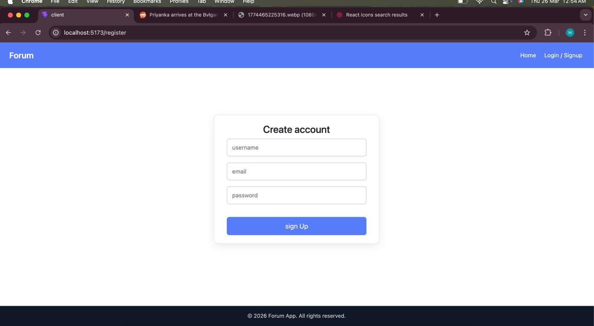
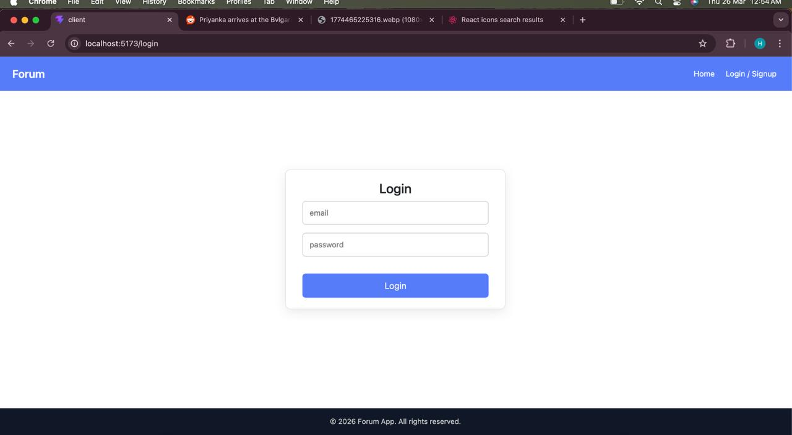
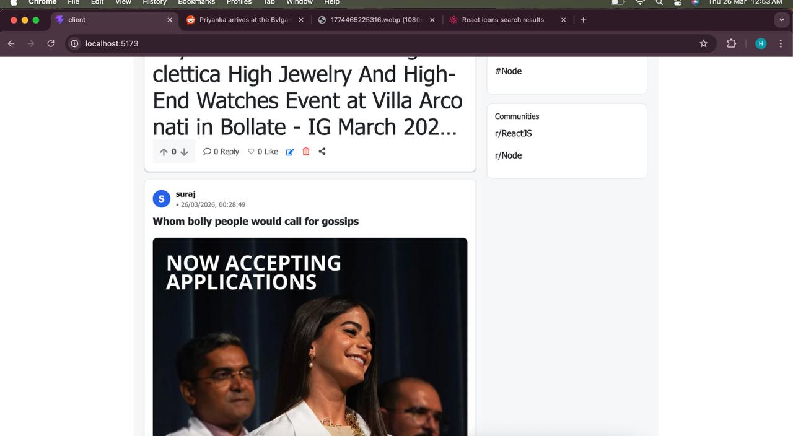
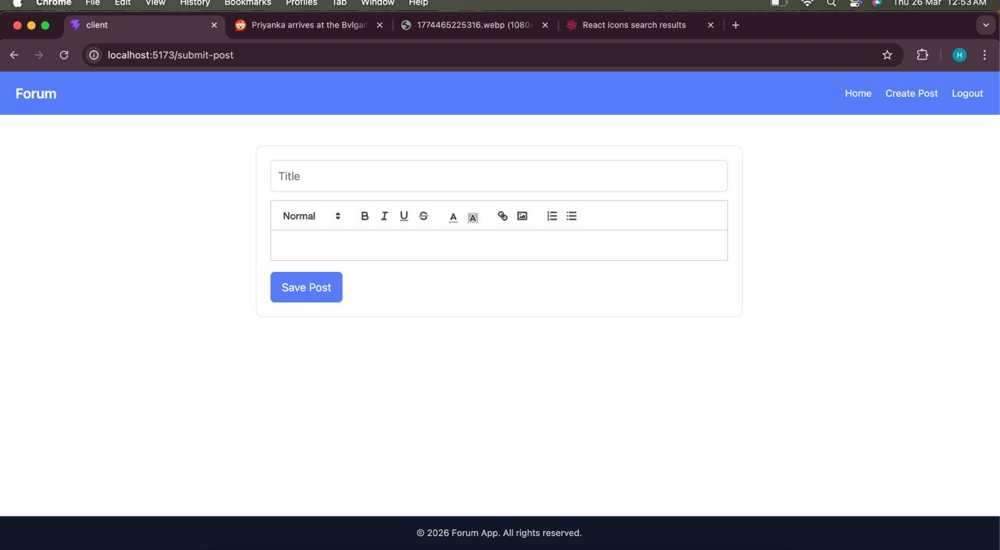
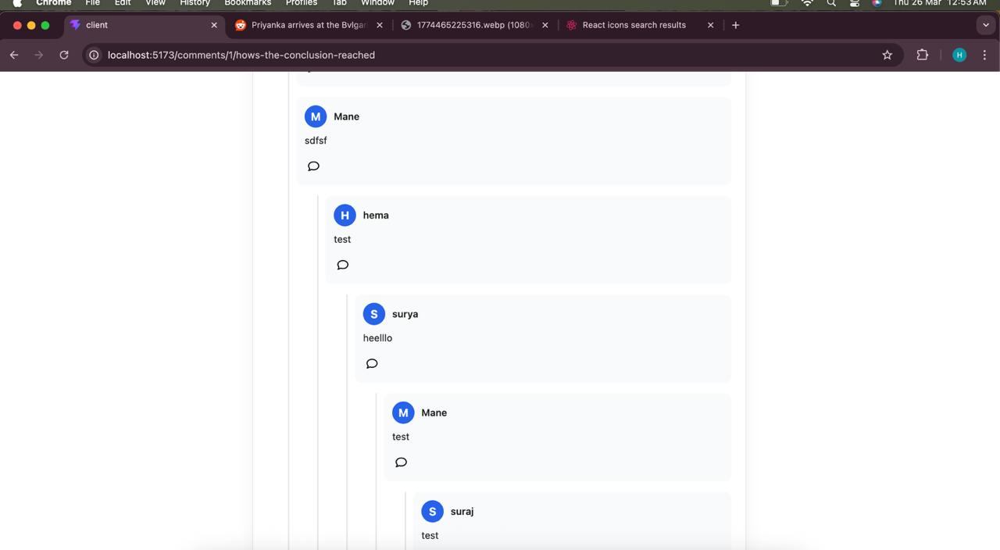

# Forum
Forum App

This is a simple forum application built as part of an assignment. Users can create posts, reply to posts, and manage their own content with proper authentication and authorization.

Features
User registration and login
JWT-based authentication
Create and view posts
Reply to posts (including nested replies)
Edit and delete your own replies
Delete your own post only if it has no replies
Rich text (reqct quill) editor with image upload
Public access to view posts and replies
Tech Stack

Frontend

React.js (Vite)
Redux Toolkit (for authentication)
React Bootstrap
React Icons
React Quill (for rich text editor)

Backend

Node.js
Express.js
Sequelize ORM
SQLite database
JWT authentication
Multer (for image uploads)

Setup Instructions
Clone the project

git clone <repo-url>
cd forum-app

Backend Setup
cd server
npm install

Create a .env file:
PORT=8000
JWT_SECRET=your_secret

Run backend:
npm start
Server will run on:
http://localhost:8000

Frontend Setup

cd client
npm install
npm run dev

App will run on:
http://localhost:5173

API Overview

Auth
POST /auth/register
POST /auth/login

Posts
GET /forumpost/getdata
GET /forumpost/getbyid/:id
POST /forumpost/create
PUT /forumpost/update/:id
POST /forumpost/trash/:id

Replies
GET /reply/getbyid/:id
POST /reply/create
PUT /reply/update/:id
POST /reply/trash/:id

Upload
POST /forumpost/uploads

Rules Implemented
Only logged-in users can create posts and replies
Users can edit/delete only their own replies
Users can delete their own post only if it has no replies
Basic validation for title and body
Consistent JSON responses from backend

Notes
Images are uploaded using Multer and stored in the /uploads folder
Static files are served using Express
React Quill is used for post content with image support

What I focused on
Keeping API structure simple and clean
Handling nested replies properly
Making sure authorization rules are correctly enforced
Smooth user experience while creating posts and replies

Author

Hema Mane

